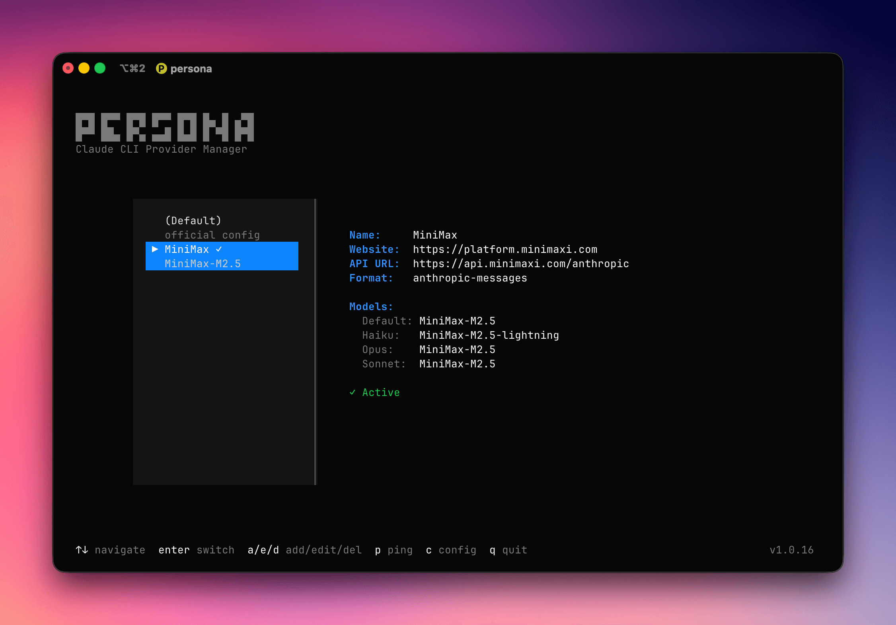

# Persona

AI 编程 CLI Provider 管理工具

## 界面



[中文文档](README.zh-CN.md) | [English Documentation](README.md)

## 安装

### 快速安装

```bash
curl -sSfL https://raw.githubusercontent.com/puterjam/persona/refs/heads/dev/install.sh | bash
```

自定义安装目录：
```bash
curl -sSfL https://raw.githubusercontent.com/puterjam/persona/refs/heads/dev/install.sh | bash -s -- -d /usr/local/bin
```

### 手动下载
### 支持的平台

| 平台 | 架构 | 文件名 |
|------|------|--------|
| macOS | ARM64 (Apple Silicon) | `persona-{version}-bun-darwin-arm64` |
| macOS | x64 (Intel) | `persona-{version}-bun-darwin-x64` |
| Linux | x64 | `persona-{version}-bun-linux-x64` |
| Linux | ARM64 | `persona-{version}-bun-linux-arm64` |
| Windows | x64 | `persona-{version}-bun-windows-x64.exe` |

下载对应系统的可执行文件，在 Linux/macOS 上添加执行权限，并添加到 PATH。

## 使用方法

### 交互模式

启动交互式 TUI：

```bash
persona
```

**快捷键：**

| 按键 | 功能 |
|------|------|
| ↑/↓ | 浏览 provider 列表 |
| Enter | 切换到选中的 provider |
| a | 新增 provider |
| e | 编辑选中的 provider |
| d | 删除选中的 provider |
| p | 测试 ping 选中的 provider |
| t | 更换风格 |
| q | 退出 |

### 命令行模式

#### 查看 Providers

```bash
persona ls
```

#### 新增 Provider

```bash
persona add
```

#### 切换 Provider

```bash
persona use <provider-id>
```

#### 测试 Provider

```bash
persona ping <provider-id>
```

#### 删除 Provider

```bash
persona rm <provider-id>
```

#### 查看当前状态

```bash
persona status
```

#### 主题管理

```bash
persona theme              # 显示当前主题
persona theme list         # 列出可用主题
persona theme <名称>       # 切换主题 (persona, gruvbox, dracula, nord)
```

#### 环境变量覆盖

```bash
persona env                # 显示环境变量覆盖配置
persona env edit          # 编辑环境变量覆盖配置
```

#### Provider 模板

```bash
persona templates         # 列出可用的 provider 模板
```

## 配置文件

- **Provider 配置：** `~/.persona/config.json`
- **通用配置：** `~/.persona/general.json`

## 主题

Persona 支持多种配色主题：

| 主题 | 描述 |
|------|------|
| persona | 默认深色主题 |
| gruvbox | 复古配色 |
| dracula | 紫色暗色主题 |
| nord | 北欧蓝 |

## 许可证

MIT
